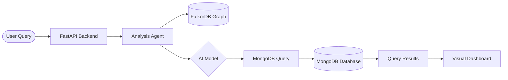

<div align="center">
  

https://github.com/user-attachments/assets/eec0808c-570c-4274-b9c1-1eaff9a0701f


  
  <h1>✨ QueryWeaver: Text-to-MongoDB ✨</h1>
  <p><b>Transform natural language into powerful MongoDB queries with graph-powered schema intelligence.</b></p>

  <div>
    <a href="https://discord.gg/b32KEzMzce">
      
    </a>
    <a href="https://app.falkordb.cloud">
      
    </a>
    <a href="https://hub.docker.com/r/falkordb/queryweaver/">
      
    </a>
    <a href="https://app.queryweaver.ai/docs">
      
    </a>
  </div>
</div>

---

## 🚀 Overview

QueryWeaver is an **open-source Text-to-MongoDB** tool that bridges the gap between natural language and database queries. By leveraging **graph-powered schema understanding**, it converts plain-English questions into valid MongoDB aggregation pipelines and find queries.

### Key Features
- 🧠 **Graph-Powered AI**: Uses FalkorDB to maintain high-fidelity schema graphs for better query accuracy.
- 🔌 **REST API & MCP**: Exposes clean REST endpoints and Model Context Protocol (MCP) for seamless integration.
- 💬 **Interactive Chat**: Streaming responses with reasoning steps and confirmation for destructive operations.
- 🔐 **Secure & Scalable**: Support for OAuth (Google/GitHub), API tokens, and production-ready deployments.

---

## 🏗️ How It Works

QueryWeaver uses a sophisticated multi-agent system to process your requests:

1. **Schema Extraction**: Connects to your MongoDB/PostgreSQL/MySQL database and extracts metadata (collections, fields, types, and references).
2. **Graph Modeling**: Stores this metadata in **FalkorDB** as a graph, mapping relationships and semantic descriptions.
3. **Natural Language Processing**: When you ask a question, the `AnalysisAgent` retrieves relevant schema context from the graph.
4. **Query Generation**: The LLM (OpenAI, Azure, or Gemini) generates a structured JSON containing the MongoDB query.
5. **Execution & Feedback**: The query is executed, and the results are returned alongside a natural language explanation.



---

## 📥 Getting Started

### 🐳 Run with Docker (Recommended)
The fastest way to evaluate QueryWeaver is via Docker:

```bash
docker run -p 5000:5000 -it falkordb/queryweaver
```

Access the dashboard at: [http://localhost:5000](http://localhost:5000)

### 🛠️ Local Installation (Development)

#### 1. Prerequisites
- **Python 3.12+** and `pipenv`
- **Node.js 18+** and `npm`
- **FalkorDB** instance (local or via [FalkorDB Cloud](https://app.falkordb.cloud))

#### 2. Backend Setup
```bash
# Clone the repository
git clone https://github.com/akash247777/QueryWeaver-Text-to-MongoDB-.git
cd QueryWeaver-main

# Install dependencies
pipenv sync --dev

# Set up environment variables
cp .env.example .env
# Edit .env and add your AI keys (OPENAI_API_KEY, etc.)
```

#### 3. Frontend Setup
```bash
cd app
npm install
```

#### 4. Run the Application

Start the backend (from the root):
```powershell
python -m api.index
```

Start the frontend (from `/app`):
```powershell
npm run dev
```

---

## ⚙️ Configuration (.env)

| Variable | Description | Required |
|----------|-------------|----------|
| `FASTAPI_SECRET_KEY` | Secret for session management | Yes |
| `FALKORDB_URL` | Connection URL (e.g., `redis://localhost:6379/0`) | Yes |
| `OPENAI_API_KEY` | API Key for OpenAI models | Optional |
| `GOOGLE_API_KEY` | API Key for Gemini models | Optional |
| `AZURE_API_KEY` | API Key for Azure OpenAI | Optional |
| `MONGODB_URL` | Your target MongoDB database connection | Yes (for queries) |

> [!TIP]
> Use `.env.example` as a template for all available configuration options.

---

## 🧪 Testing

We use **Pytest** for backend tests and **Playwright** for End-to-End browser testing.

```bash
# Setup test environment
make setup-dev

# Run all tests
make test
```

---
# How the code works if ask any question ?

To explain how QueryWeaver works in detail, we can break it down into five core layers: the Request Layer, the Schema/Graph Layer, the Agentic Brain, the Execution Engine, and the User Interface.

Here is the deep dive into each component:

1. 🏗️ The Request Layer (FastAPI Backend)

The backend is built with FastAPI, designed to be fast and highly modular.

Application Factory: It uses a 

create_app
 pattern to initialize security middlewares (CSRF protection, HSTS, Secure Sessions) and OAuth handlers (Google/GitHub).
Dual-Purpose Server: It acts as both a REST API and an MCP (Model Context Protocol) Server. If enabled, it exposes an /mcp endpoint that allows other AI tools (like Claude or Gemini) to "call" QueryWeaver as a tool.
SPA Hosting: It serves the built React frontend directly, meaning you only need to run one server process in production.

2. 🗺️ The Schema & Graph Layer (FalkorDB)

This is the "secret sauce" that makes QueryWeaver more accurate than simple text-to-SQL/NoSQL tools.

Loaders: When you connect a database (e.g., MongoDB), the 

mongodb_loader.py
 scans the collections, samples documents to infer types, and identifies relationships (like _id references).
The Knowledge Graph: Instead of just sending a raw text list of tables to the AI, QueryWeaver stores the database structure in FalkorDB as a graph.
Nodes: Collections and Fields.
Edges: Relationships, foreign keys, and semantic links.
Context Retrieval: When you ask a question, the system queries this graph to pull only the relevant parts of the schema, preventing the LLM from getting confused by large, complex databases.

3. 🧠 The Agentic Brain (

AnalysisAgent
)
The logic lives in 

api/agents/analysis_agent.py
. It follows a structured "Reasoning Path":

Schema Formatting: It converts the graph data into a natural-language-friendly schema description.
Memory Retrieval: It checks for previous interactions (e.g., "What did I ask 5 minutes ago?") to handle follow-up questions like "Now show me only the expensive ones."
System Prompting: It uses a highly engineered prompt with Immutable Safety Rules (to prevent unauthorized data access) and Production Rules (guidelines on when to use $lookup vs $match in MongoDB).
LiteLLM Integration: It uses the litellm library to communicate with your choice of AI model (OpenAI, Gemini, Azure). This makes the code provider-agnostic.

4. ⚙️ Execution & Feedback Loop
Once the LLM generates a JSON body containing the MongoDB query:

Validation: The backend validates the JSON structure to ensure it's a valid query/pipeline.
Streaming: The reasoning steps and the query are streamed back to the user in real-time using Server-Sent Events (SSE).
Destructive Guards: If the agent detects a destructive operation (like deleteMany), it is programmed to send a "Confirmation Required" signal to the frontend before executing.

5. 💻 The Frontend (React + Vite)
The UI is a sleek, modern dashboard:

State Management: It uses TanStack Query (React Query) for efficient data fetching and caching.
Dynamic Visuals: Uses D3.js or Recharts to visualize the database schema graph and the results of the queries.
Dashboard: A premium interface built with Radix UI and Tailwind CSS, providing a "glassmorphism" aesthetic that feels alive and responsive.
🔄 The Full Lifecycle of a Query
User asks: "Who are the top 5 customers from New York who spent the most this month?"
Backend pulls the "Customer" and "Orders" schema nodes from the FalkorDB Graph.
AnalysisAgent combines the schema with the query and sends it to the LLM.
LLM responds with a MongoDB Aggregation Pipeline ($match, $lookup, $group, $sort, $limit).
Backend executes the pipeline against your MongoDB database.
UI renders the results in a table and explains the logic in plain English.
By combining Graph Intelligence with Large Language Models, QueryWeaver understands what your data means, not just where it is stored.

## 📜 License

This project is licensed under the **GNU Affero General Public License (AGPL)**. See the [LICENSE](LICENSE) file for details.

© 2025 FalkorDB Ltd.


